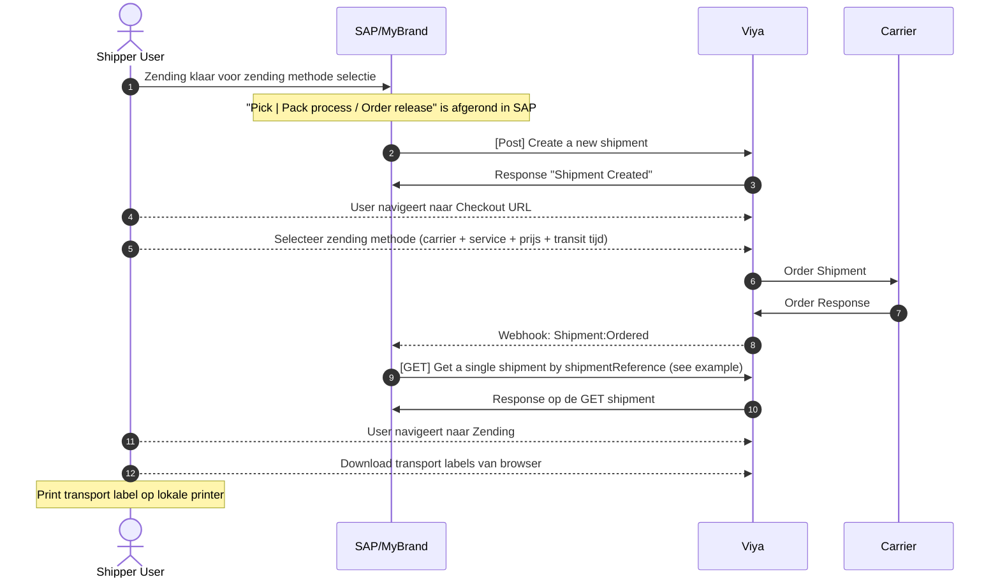
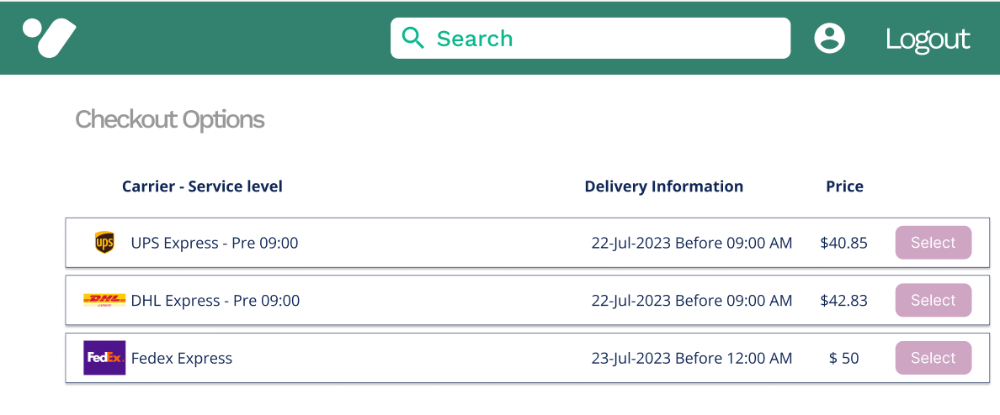

# Contiweb

In onderstaand document staat het voorkeurs process beschreven voor het gebruik van de Viya Shipment API en UI door Contiweb/SAP.

Binnen dit process zijn een aantal stappen gedefinieerd, 

1. Authenticatie opzetten
2. Zending API POST via SAP/Mybrand naar Viya + voorbeelden
3. Selectie van zendings methode door gebruiker (carrier + service + prijs + transit tijd)
4. Zendings API GET aan SAP/Mybrand, getriggerd via een webhook.

In het interactie diagram hieronder staat een uitgebreide versie van alle interactie tussen gebruiker (User), Shipper (SAP/Mybrand), Carrier en Viya. 

## Interaction Diagram



## Authenticatie

Voor het opzetten van de Authentication met SAP/Mybrand wordt een Machine2Machine of Auth flow verwacht. Deze flow is nog in ontwikkeling binnen Viya en zal in gezamenlijk overleg met Mybrand / Contiweb worden afgerond.


## Zending API POST via SAP/Mybrand naar Viya

Op het moment van `Pick | Pack` na de `Order release` wordt de  `Post:` [Create a new shipment](https://viya.me/api-shipping/#tag/Shipment/paths/~1api~1v1~1shipments/post) API aangeroepen, waarmee een zending in het systeem van Viya gemaakt wordt. Afhankelijk van het verzendscenario zijn hiervoor verschillende velden van belang, in de bijlage zijn enkele voorbeelden van deze zending scenario's toegevoegd.

De response op dit bericht bevat een id en de reference die is opgegeven door contiweb en later gebruikt kan worden in de UI om de zending terug te zoeken.

Response:
``` json
{
    "id": "string",
    "reference": "string",
    "url":{
      "checkout":"https://contiweb.viya.me/shipment/{reference}/checkout",
      "edit":"https://contiweb.viya.me/shipment/{reference}/edit"
    }
}
```

## Selectie van zendings methode door gebruiker (carrier + service + prijs + transit tijd)

Na dat zending is aangemaakt kan een gebruiker van Contiweb naar de checkout url (zoals hierboven beschreven) om een zendingsmethode te selecteren. Eventuele exceptie afhandeling, bijvoorbeeld door missende data, zal ook plaats vinden in de UI.

Hieronder staat een voorbeeld pagina van het zending methode selectie scherm.



## Zendings API GET aan SAP/Mybrand, getriggerd via een webhook.

Tijdens het zending process kunnen een aantal webhook gebruikt worden door SAP/Mybrand om de zending in SAP bij te werken. Ons voorstel is om de webhook Shipment:Ordered te gebruiken, dit is het moment na een succesvolle boeking bij een vervoerder.

#### Configuratie Webhook

De configuratie van de callback url is per verzendlocatie en voor de `Shipment Webhook Events`, uiteindelijk configuratie zal plaats vinden via de Viya UI.

- Locatie:
  - Shipment Webhook Events
    - Created
    - CheckoutCompleted
    - Ordered
    - Confirmed
    - Executed

Onderstaand bericht is de response van de webhook bij een successvolle boeking, verdere exceptie afhandeling vind plaats in de user interface bij het selecteren van de zendings methode.

``` json
{
  "event":"shipment-ordered",
  "shipmentReference":"contiweb-shipment-reference-hier",
  "link":"https://contiweb.viya.me/shipping/api/v1/shipments/{shipmentReference}",
  "datetime":""
}
```

#### Updaten zending details in SAP

In de webhook wordt een link voor de [GET /api/v1/shipment/](https://viya.me/api-shipping/#tag/Shipment/paths/~1api~1v1~1shipments~1%7BshipmentId%7D/get) terug gegeven die gebruikt kan worden om zending data op te halen. In de bijlage zijn ook hiervan een aantal voorbeelden toegevoegd.